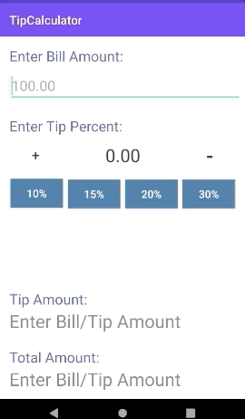

# Mobile_Apps_Kotlin
Andriod apps developed in Kotlin

Tip Calculator 
---
This app allows the user to enter the bill amount and desired tip percentage to calculate the tip amount and the total.

Workout App
-----
This app uses a timer and counts down a number of seconds for each selected workout. The user is able to select a range of various workouts and the duration of the workouts. 

On the timer screen, it dispalys an image of the workout, the timer, and text letter the user know the next workout.

